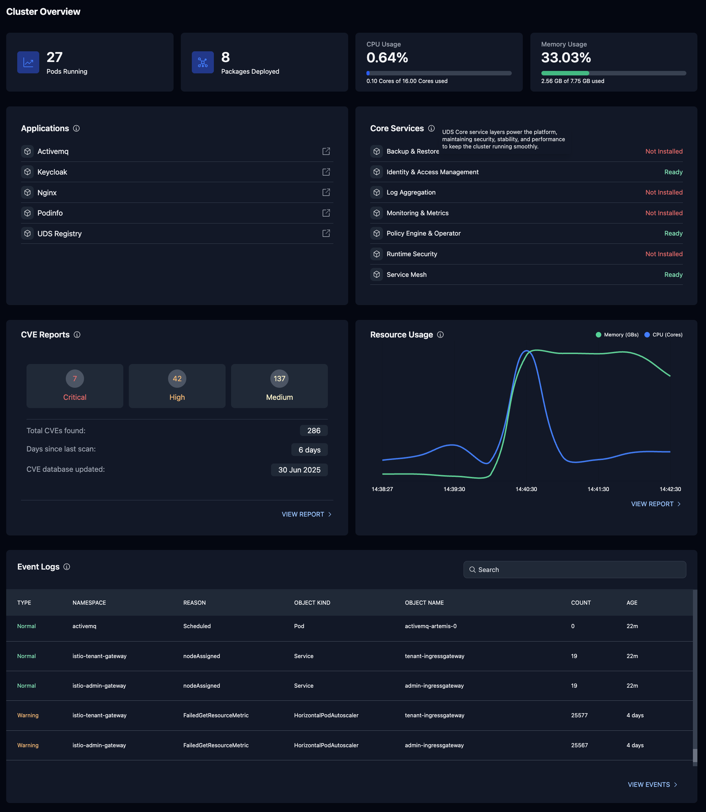

# UDS UI - Coding Challenge

## Overview

UDS UI is analogous to a dashboard for a Kubernetes cluster, providing views and insights into the cluster's resources and health.

In this challenge, we ask you to implement a "Cluster Overview" page. As you navigate the challenge, focus on working as you would normally. We do not expect you to spend more than **four hours** on this challenge.

### Evaluation Criteria

Your submission will be evaluated based on:

- **Quality and Completeness** - We value clean, maintainable code that implements the requested features correctly
- **Technical Alignment** - Solutions must use the provided tech stack without introducing unnecessary dependencies
- **API Integration** - Proper handling of API responses, including error states and loading conditions
- **UI Implementation** - Adherence to the provided design while implementing a responsive and accessible interface
- **Code Organization** - Clear structure that follows best practices and demonstrates understanding of component architecture
- **Problem Solving** - Demonstrating ability to solve problems and make trade-offs

### Setup

**Prerequisites**

- [Docker](https://docs.docker.com/engine/install/)
- (optional) [Jetify DevBox](https://www.jetify.com/docs/devbox/quickstart/), you _may_ use devbox, but it is not required. see [devbox.json](devbox.json) for dependencies and versions used.

**Setup**

| Step | Command | Notes |
|------|---------|-------|
| 1 | `git clone https://github.com/defenseunicorns/frontend-technical-assessment.git` | Clone this repository |
| 2 | `k3d cluster create uds-ui --image rancher/k3s:v1.33.0-k3s1` | Creates a lightweight Kubernetes cluster. Required for the API to interact with. |
| 3 | Download the API binary for your system | The binaries can be found [here](https://github.com/defenseunicorns/frontend-technical-assessment/releases) (use the latest release) |
| 4 | `./uds-api-<OS>-<ARCH>` (e.g. `./uds-api-darwin-arm64`) | Runs the API. Verify at `https://runtime-local.uds.dev:8443/healthz` (errors expected due to missing UDS custom resources) |
| 5 | Access in a browser `https://runtime-local.uds.dev:8443/healthz` | Verify the API is running. You could also curl or wget |
| 6 | Access in a browser `https://runtime-local.uds.dev:8443/swagger/index.html` | View the Swagger API documentation |
| 7 | `cd ui && npm i && npm run dev` | Installs dependencies and runs the UI. Accessible at `http://localhost:5173` |
| 8 | Review baseline implementation | Strongly recommended before starting development |

### Implementation

Given this sample screenshot, please implement the cluster overview page:

- it should pull live data from the API
- it should be similar in design and theme, we will not be assessing your ability to perfectly match the design
- you should build something that is ready for review as a Pull Request

### Widget Descriptions

#### Pods Running

Already implemented as an example. This shows the number of active pods running in the cluster `kubectl get pods -A`

#### Packages Deployed

This shows the number of UDS packages deployed in the cluster `kubectl get packages -A`

NOTE: You aren't required to deploy UDS packages, but the api endpoint `api/v1/resources/configs/uds-packages` is available.

#### CPU and Memory Usage

This shows the realtime resource consumption of the cluster compared to available resources. see `GET /api/v1/monitor/cluster-overview`

#### Applications

This shows applications with a link to the application. The required data is not available in the API. You may choose to implement with links to your favorite websites.

#### Core Services

This shows Core Services availability. The data is already available in the component for you. Expect all services to have
status "Not Installed"

#### CVE Reports

A snapshot of CVEs (Common Vulnerabilities and Exposures) in the cluster. see `GET /api/v1/security/cves`

NOTE: While the API endpoint is available, the CVE database is not available. You may choose to implement a mock and exercise the widget in tests.

#### Resource Usage

A time-series graph of resource usage. see `GET /api/v1/monitor/cluster-overview`

NOTE: the "View Report" hyperlink is not required.

#### Event Logs

A table of events from the cluster. see `GET /api/v1/resources/events`

### A suggested test case

| Step | Command | Notes |
|------|---------|-------|
| 1 | `helm upgrade --install --wait podinfo --namespace default oci://ghcr.io/stefanprodan/charts/podinfo` | Deploy a simple Kubernetes application [podinfo](https://github.com/stefanprodan/podinfo) |

### Teardown

| Command | Notes |
|---------|-------|
| `k3d cluster delete uds-ui` | Delete all k3d kubernetes clusters |

## Submission

1. populate a response to [ChallengeQuestions.md](ChallengeQuestions.md)
2. Ensure all changes have been committed
3. push your changes to a branch
